# Manual de Usuario — MotoConnect

**Versión:** 1.2.5
**Sistema operativo:** Android
**Fecha:** Marzo 2026

---

## Tabla de contenido

1. [Introducción](#1-introducción)
2. [Requisitos del dispositivo](#2-requisitos-del-dispositivo)
3. [Instalación de la aplicación](#3-instalación-de-la-aplicación)
4. [Registro e inicio de sesión](#4-registro-e-inicio-de-sesión)
5. [Pantalla principal](#5-pantalla-principal)
6. [Módulo Rutas](#6-módulo-rutas)
7. [Módulo Grupos y Sesiones](#7-módulo-grupos-y-sesiones)
8. [Módulo Eventos](#8-módulo-eventos)
9. [Módulo Talleres](#9-módulo-talleres)
10. [Módulo Comunidad](#10-módulo-comunidad)
11. [Perfil](#11-perfil)
12. [Notificaciones](#12-notificaciones)
13. [Mensajes importantes](#13-mensajes-importantes)
14. [Problemas comunes](#14-problemas-comunes)
15. [Buenas prácticas](#15-buenas-prácticas)

---

## 1. Introducción

**MotoConnect** es una aplicación móvil diseñada para motociclistas. Permite planificar y navegar rutas, salir en grupo compartiendo ubicaciones en tiempo real, enterarte de eventos de la comunidad, encontrar talleres cercanos y conectar con otros motociclistas.

### ¿Para qué sirve?

- Trazar y navegar rutas con indicaciones paso a paso.
- Salir en grupo y ver en el mapa dónde está cada integrante.
- Consultar y crear eventos para la comunidad motera.
- Encontrar talleres de motocicletas.
- Publicar y leer contenido de la comunidad.

---

## 2. Requisitos del dispositivo

| Requisito | Detalle |
|---|---|
| Sistema operativo | Android |
| Conexión a internet | Requerida (datos móviles o WiFi) |
| GPS | Requerido para navegación y sesiones grupales |
| Permisos | Ubicación precisa, ubicación en segundo plano, notificaciones |

### Permisos que solicitará la aplicación

Cuando abras la app por primera vez, te pedirá los siguientes permisos. Es importante aceptarlos todos para que la app funcione correctamente:

- **Ubicación precisa:** para mostrar tu posición en el mapa.
- **Ubicación en segundo plano:** para seguir compartiendo tu posición durante una sesión grupal aunque cambies de aplicación.
- **Notificaciones:** para recibir alertas de eventos y sesiones.

---

## 3. Instalación de la aplicación

MotoConnect se instala desde un archivo **APK** (no está en la tienda de aplicaciones). Sigue estos pasos:

### Paso 1 — Descarga el archivo APK

Descarga el archivo **MotoConnect.apk** desde el enlace o medio que te fue compartido y guárdalo en tu dispositivo.

### Paso 2 — Permite la instalación de aplicaciones externas

Antes de instalar, tu celular debe tener habilitada la opción de instalar aplicaciones fuera de la tienda oficial.

> **¿No sabes cómo hacerlo?**
> Busca en tu navegador: *"cómo instalar APK en [modelo de tu celular]"*.
> Los pasos varían según el fabricante (Samsung, Xiaomi, Motorola, etc.).

### Paso 3 — Abre el archivo APK

1. Ve a la carpeta de **Descargas** de tu celular.
2. Toca el archivo **MotoConnect.apk**.
3. Si aparece una advertencia de seguridad, selecciona **"Instalar de todas formas"** o **"Continuar"**.

### Paso 4 — Completa la instalación

1. Toca **"Instalar"** cuando aparezca la pantalla de instalación.
2. Espera unos segundos a que termine.
3. Toca **"Abrir"** para iniciar la app, o búscala en tus aplicaciones instaladas.

---

## 4. Registro e inicio de sesión

### 4.1 Crear una cuenta nueva

Si es la primera vez que usas MotoConnect, necesitas crear una cuenta.

1. Abre la app. Verás la pantalla de inicio de sesión.
2. Toca **"¿No tienes cuenta? Registrate"**.
3. Completa los siguientes campos:
   - **Nombre completo** (mínimo 3 caracteres)
   - **Correo electrónico**
   - **Contraseña** (mínimo 6 caracteres)
   - **Confirmar contraseña**
4. Toca **"Registrarse"**.
5. Aparecerá un mensaje de bienvenida. Luego serás redirigido a la pantalla de inicio de sesión.

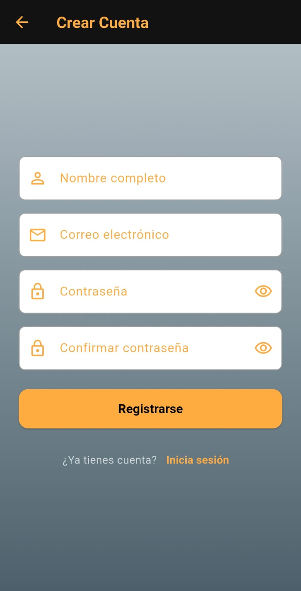

### 4.2 Iniciar sesión

1. Ingresa tu **correo electrónico** y **contraseña**.
2. Toca **"Iniciar Sesión"**.

**Opción alternativa:** Toca **"Continuar con Google"** para iniciar sesión con tu cuenta de Google.

### 4.3 Recuperar contraseña

1. En la pantalla de inicio de sesión, toca **"¿Olvidaste tu contraseña?"**.
2. Ingresa tu correo electrónico.
3. Recibirás un correo con un link, es importante que el link se abra desde el dispositivo movil con la aplicación.
4. Revisa tu bandeja de entrada (y la carpeta de spam si no lo ves).

---

## 5. Pantalla principal

Después de iniciar sesión, verás la pantalla principal con acceso a los cinco módulos de la app:

| Módulo | Descripción |
|---|---|
| **Rutas** | Navega y gestiona rutas en moto |
| **Talleres** | Encuentra talleres de motocicletas |
| **Eventos** | Consulta y crea eventos de la comunidad |
| **Comunidad** | Lee y publica contenido |
| **Grupos** | Organiza y participa en salidas grupales |

En la esquina inferior derecha encontrarás el **botón de perfil** (color naranja) para acceder a tu configuración personal.

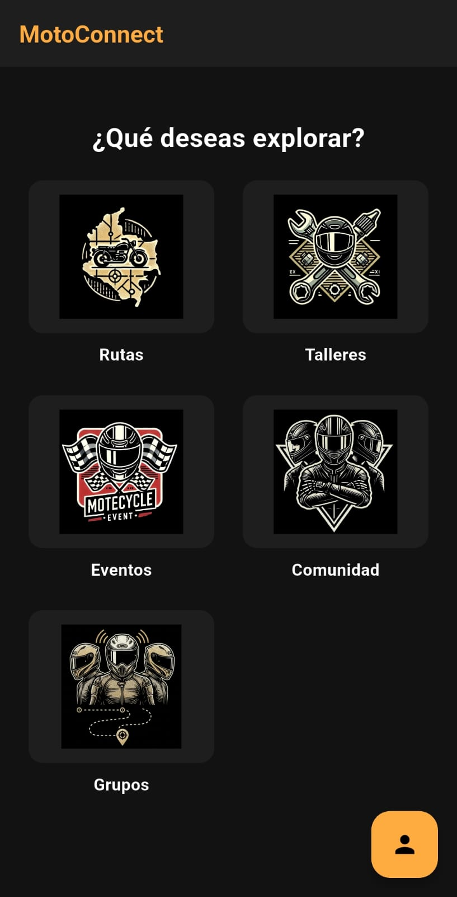

---

## 6. Módulo Rutas

Este módulo te permite buscar destinos, navegar con indicaciones paso a paso, crear rutas personalizadas y guardar tus rutas favoritas.

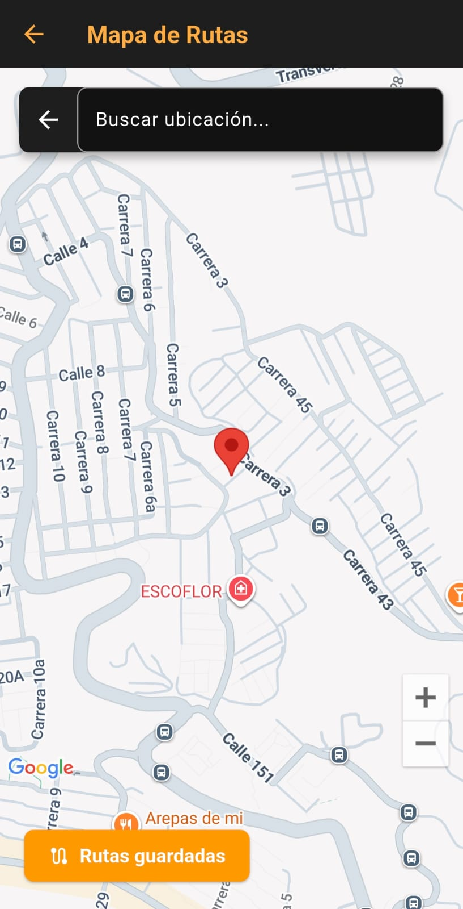

### 6.1 Buscar una ubicación

1. Toca el **campo de búsqueda** en la parte superior del mapa.
2. Escribe el nombre de tu destino (dirección, lugar o ciudad).
3. Selecciona la opción correcta de la lista que aparece.
4. La ruta quedará marcada en el mapa.

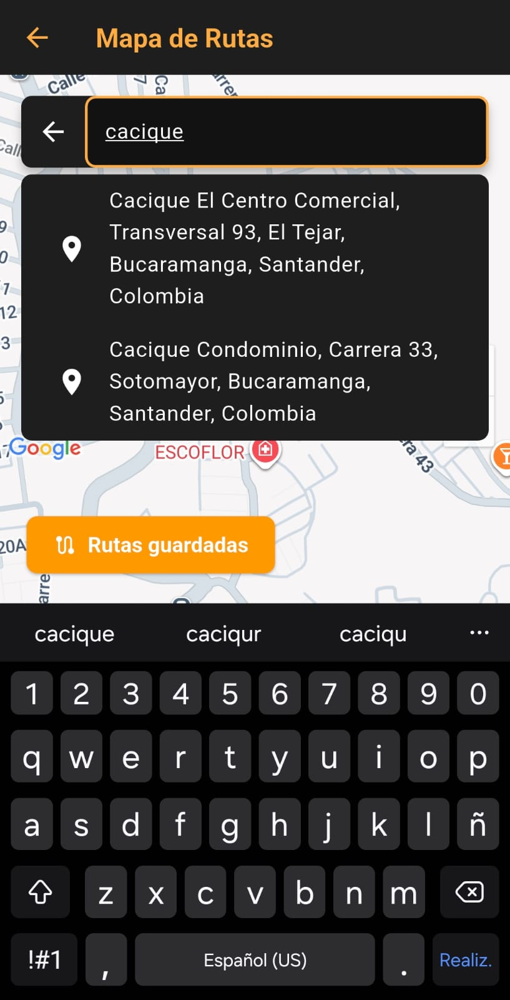

### 6.2 Iniciar una ruta

1. Busca tu destino (ver sección 6.1).
2. Toca el botón **"Iniciar ruta"** en la parte inferior de la pantalla.
3. La app comenzará a calcular el camino. Verás el mensaje **"Calculando ruta..."**.
4. Una vez calculada, aparecerá el panel de navegación con las indicaciones.

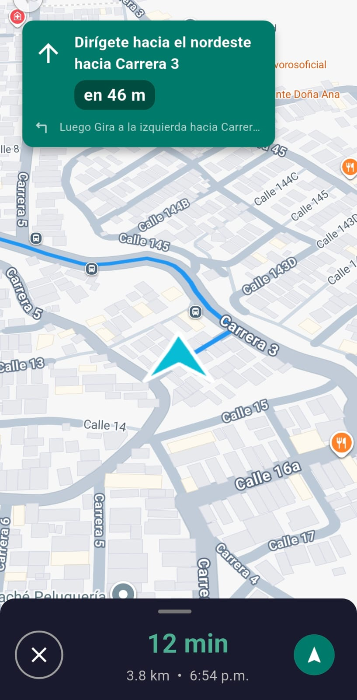

### 6.3 Pantalla de navegación — qué significa cada elemento

Durante la navegación verás dos paneles:

**Panel superior (instrucciones):**
- Icono de la próxima maniobra (girar a la derecha, izquierda, etc.)
- Texto con la instrucción actual (por ejemplo: *"Gira a la derecha en Calle 45"*)
- Distancia hasta la próxima maniobra (por ejemplo: *"en 250m"*)
- Previsualización del siguiente giro

**Panel inferior (información del viaje):**
- Distancia restante hasta el destino
- Tiempo estimado de llegada
- Botón para centrar el mapa en tu posición
- Botón X para finalizar viaje, cancelar viaje o continuar viaje

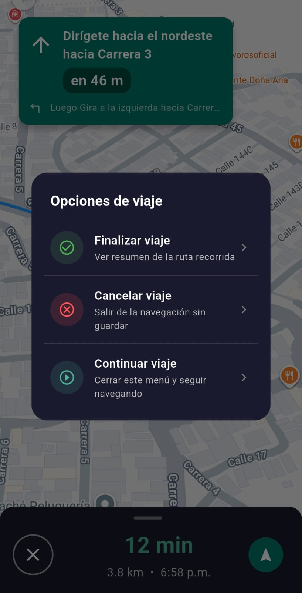

### 6.4 Finalizar una ruta

Puedes terminar la navegación de dos formas:

- **Llegar al destino:** La app detecta automáticamente que llegaste y muestra el mensaje **"¡Has llegado a tu destino!"** junto con un resumen del viaje (tiempo, distancia y velocidad promedio).
- **Terminar manualmente:** Toca el botón **"Finalizar"** en el panel inferior.

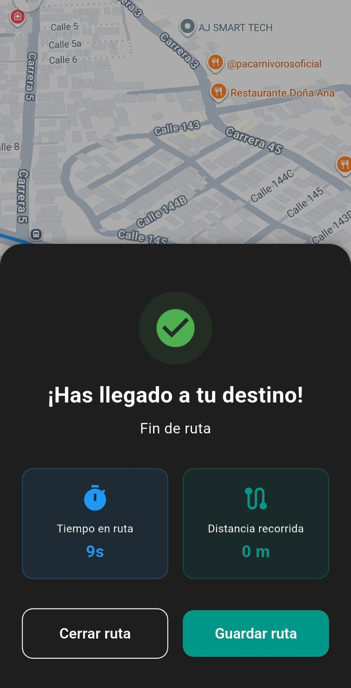

### 6.5 Guardar una ruta

Cuando termines una ruta, verás dos opciones:

- **Cerrar ruta:** cierra el resumen sin guardar.
- **Guardar ruta:** te pedirá un nombre para la ruta. Escríbelo y confirma; esto guardara la ruta recorrida.

También puedes guardar rutas desde su pantalla de detalle al seleccionar un destino.

### 6.6 Rutas guardadas

Accede a tus rutas guardadas desde el perfil o desde el módulo Rutas.

Por cada ruta puedes:
- **Abrirla en el mapa**
- **Eliminarla** (te pedirá confirmación)
- **Compartirla en la Comunidad** (te pedirá una descripción)
- Volver a recorrerla (Iniciar Navegación)

Podrás diferenciar entre una ruta recorrida o guardada, por el icono o su texto.

---

## 7. Módulo Grupos y Sesiones

Este módulo te permite salir en grupo con otros motociclistas, compartir ubicaciones en tiempo real y navegar juntos con un mapa compartido.

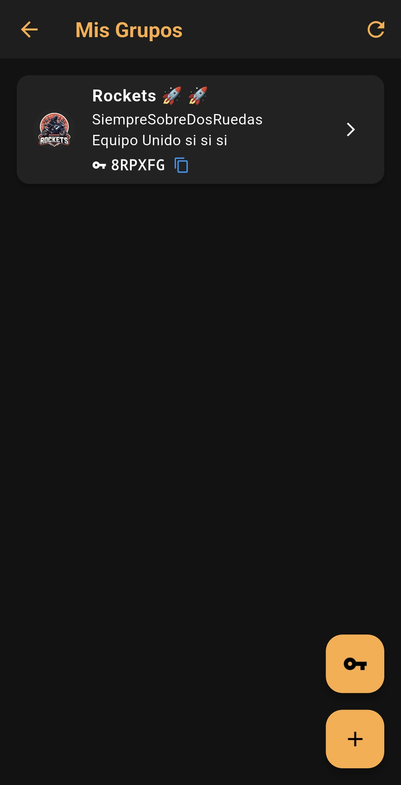

### 7.1 Ver mis grupos

Al entrar al módulo verás la lista de grupos a los que perteneces. Si no tienes ninguno, aparecerá el mensaje *"No hay grupos"*.

### 7.2 Crear un grupo

1. Toca el botón **"Crear grupo"** (parte inferior de la pantalla).
2. Completa los campos:
   - **Nombre del grupo** (obligatorio)
   - **Descripción** (opcional)
   - **Imagen del grupo** (opcional, selecciona desde la galería)
3. Confirma. La app generará automáticamente un **código de invitación** único.

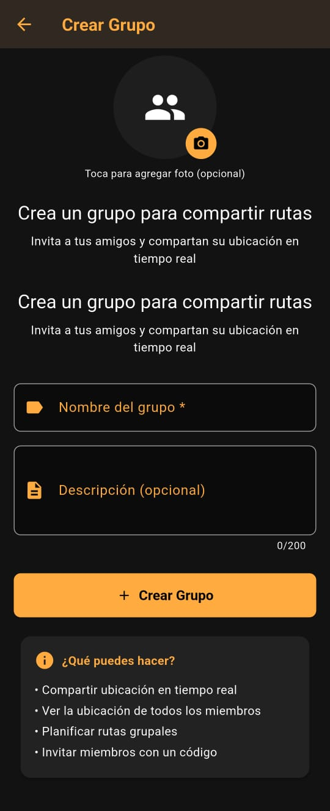
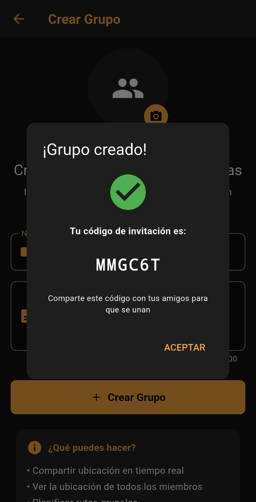

### 7.3 Unirse a un grupo

1. Toca el botón **"Unirse a grupo"**.
2. Ingresa el **código** que te compartió el administrador.
3. Tu solicitud será enviada. El administrador del grupo debe aprobarla.

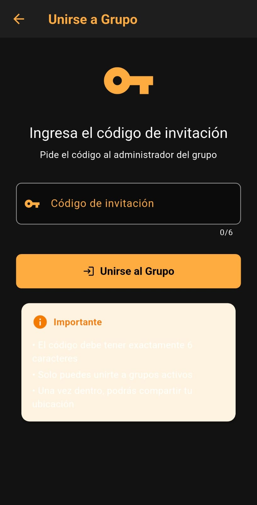

### 7.4 Copiar o regenerar el código de invitación

Desde el detalle del grupo (si eres administrador):
- Toca el ícono de copiar para copiar el código al portapapeles.
- Toca **"Regenerar código"** si quieres uno nuevo (el anterior quedará inválido).

### 7.5 Ver miembros del grupo

En la pestaña **"Miembros"** del detalle del grupo verás:
- Foto, nombre y apodo de cada integrante
- Rol (administrador o miembro)

Si eres administrador también verás el botón para **expulsar** a un miembro.

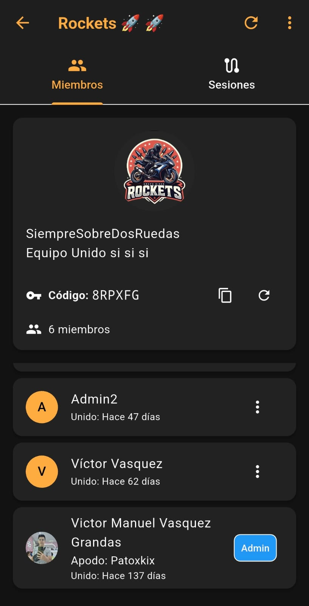

### 7.6 Gestionar solicitudes de ingreso (solo administrador)

Cuando alguien solicita unirse, aparecerá un indicador en la pantalla del grupo.

1. Toca el botón de **solicitudes pendientes**.
2. Verás la lista de personas que quieren unirse (con nombre y apodo).
3. Toca **"Aprobar"** o **"Rechazar"** para cada solicitud.

### 7.7 Iniciar una sesión grupal

Una sesión grupal es una salida en tiempo real donde todos los integrantes comparten su ubicación en el mapa.

1. Desde el detalle del grupo, toca **"Iniciar Sesión"**.
2. Escribe un nombre para la sesión (por ejemplo: *"Salida del domingo"*) y descripción opcional.
3. Confirma. Se abrirá el mapa compartido.

> Solo puede haber una sesión activa a la vez por miembro del grupo.

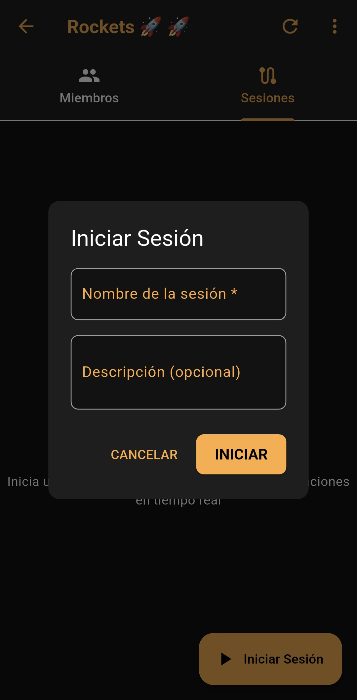

### 7.8 Unirse a una sesión activa

Si ya hay una sesión activa en tu grupo:

1. En la pestaña **"Sesiones"** del grupo verás la sesión en curso.
2. Toca **"Unirse"**.
3. Verás el mensaje: *"Solicitud enviada. Esperando aprobación del líder..."*
4. Una vez que el líder te apruebe, recibirás la confirmación: *"¡Has sido aprobado! Compartiendo ubicación..."*

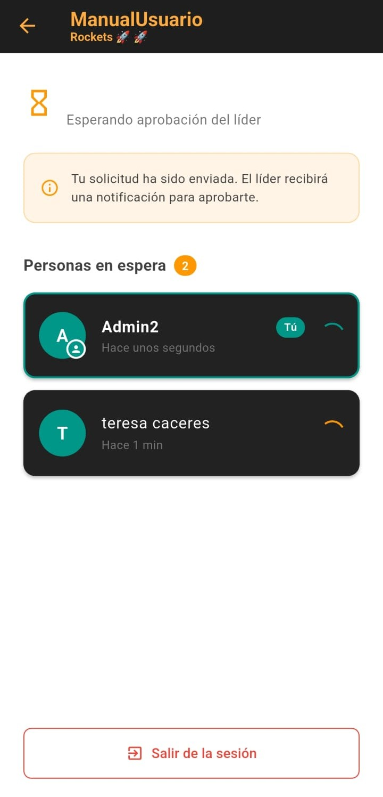

### 7.9 Mapa compartido — qué verás durante la sesión

En el mapa verás a todos los participantes con un marcador circular que mostrara la foto del miembro o su inicial si no tiene foto. 

| Color del Estado | Estado |
|---|---|
| Verde | Activo — ubicación reciente (menos de 1 minuto) |
| Amarillo | Sin actualización reciente (entre 1 y 3 minutos) |
| Naranja | Pausado — la persona pausó su ubicación manualmente |
| Gris | Sin conexión — más de 3 minutos sin señal |

Al tocar el marcador de un participante en el panel de participantes el mapa se movera la ubicacion del miembro seleccionado

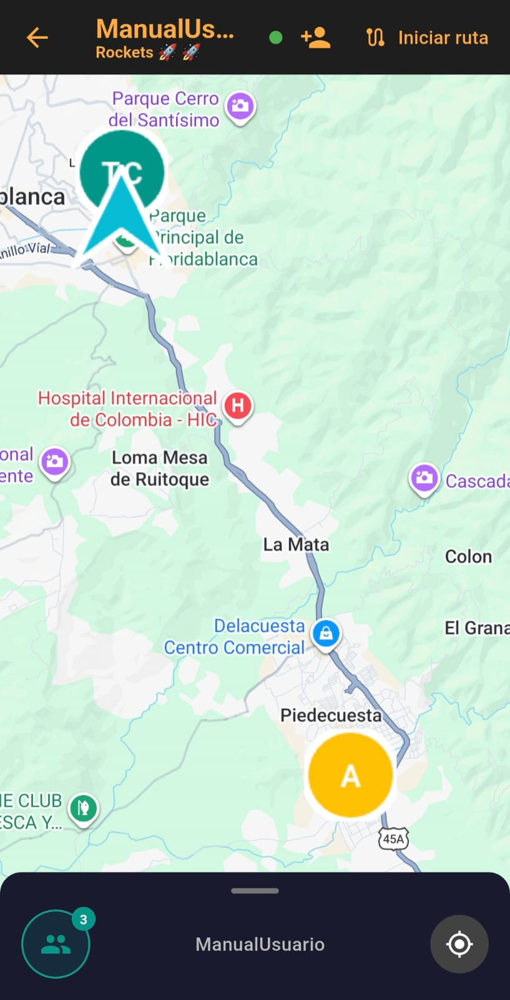

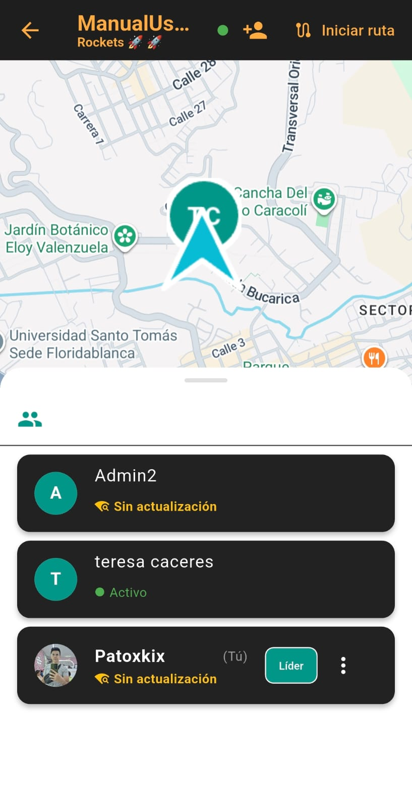

### 7.10 Pausar, reanudar mi ubicación y Emergencia

En el panel de participantes de la sesión, a cada miembro se le visualiza un menú con las siguientes opciones:

- Tocar la opción **"Pausar ubicación"** para dejar de compartir tu posición temporalmente. Los demás verán tu marcador en naranja.
- Tocar la opción **"Reanudar ubicación"** para volver a compartir tu ubicación.
- Tocar la opción **"Emergencia"**, hará que muestre una ventana para enviar una notificación de SOS a todos los participantes de la sesión.
> Usa este botón solo en situaciones reales de emergencia.
- Tocar la opción de **"Finalizar sesión"**, hará que se finalice la sesión para todos los participantes.

### 7.11 Compartir una ruta al grupo (solo líder)

El líder puede enviar una ruta a todos los participantes para que naveguen al mismo destino:

1. Selecciona **"Iniciar ruta"** selecciona el destino que deseas compartir.
2. Toca **"Iniciar"**.
3. Todos los integrantes recibirán la ruta automáticamente.

Para cancelar una ruta compartida, el líder toca **"Cancelar ruta"**. Todos los participantes lo verán en pantalla.

### 7.12 Salir de la sesión

1. Toca el botón **"Salir de la sesión"**.
2. Confirma en el diálogo que aparece.
3. Dejarás de compartir tu ubicación y saldrás del mapa compartido.

### 7.13 Finalizar la sesión (solo líder)

1. Toca el botón **"Finalizar sesión"**.
2. Confirma en el diálogo.
3. La sesión termina para todos los participantes. Aparecerá un aviso informando que la sesión fue finalizada.

### 7.14 Salir del grupo

1. Desde el detalle del grupo, toca **"Salir del grupo"**.
2. Selecciona el motivo (opcional).
3. Confirma. Recibirás el mensaje: *"Has salido del grupo"*.

### 7.15 Eliminar o editar grupo (solo administrador)

1. Desde el detalle del grupo, toca **"Eliminar grupo"** o **"Editar grupo"**.
2. Confirma la acción.

> Esta acción es permanente. Todos los miembros perderán acceso al grupo.

---

## 8. Módulo Eventos

Este módulo te permite consultar eventos de la comunidad motera, confirmar tu asistencia y crear nuevos eventos.

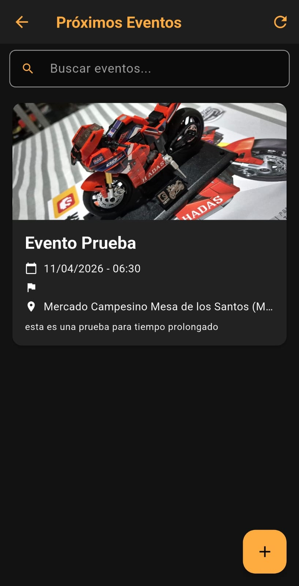

### 8.1 Ver eventos

Al entrar al módulo verás una lista de los próximos eventos con:
- Nombre del evento
- Fecha y hora
- Punto de encuentro
- Destino
- Descripción breve del evento

### 8.2 Buscar un evento

Usa el **campo de búsqueda** en la parte superior para filtrar eventos por nombre mientras escribes.

### 8.3 Ver el detalle de un evento

Toca cualquier evento para ver:
- Foto, Nombre, fecha, hora y lugar del evento
- Total Participantes con estado de asistencia marcado
- Descripción completa
- Botón para dirigir al mapa con la ubicación
- Lista de participantes y su estado de asistencia

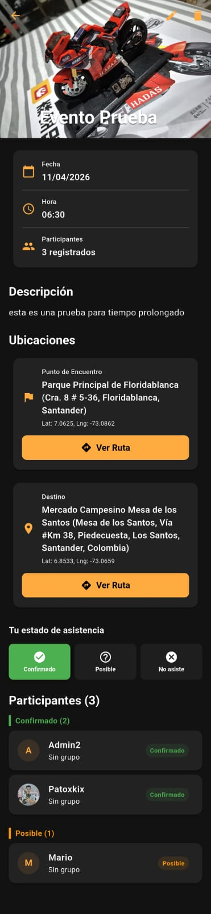

### 8.4 Confirmar asistencia

Desde el detalle del evento, selecciona tu estado:

| Opción | Significado |
|---|---|
| **Confirmado** | Confirmas tu asistencia |
| **Posible** | Puede que vayas |
| **No Asiste** | No podrás asistir |

Puedes cambiar tu respuesta en cualquier momento antes del evento.

### 8.5 Crear un evento

1. Busca el botón para crear un evento nuevo.
2. Completa los campos:
   - **Foto del evento** (opcional)
   - **Nombre del evento** (obligatorio)
   - **Fecha** y **hora**
   - **Lugar** (con selección en mapa)
   - **Descripción**
   - **Número máximo de participantes** (opcional)
   - **Imagen** (opcional)
3. Toca **"GUARDAR"**.

> Los eventos con fecha pasada no serán aceptados por la app.

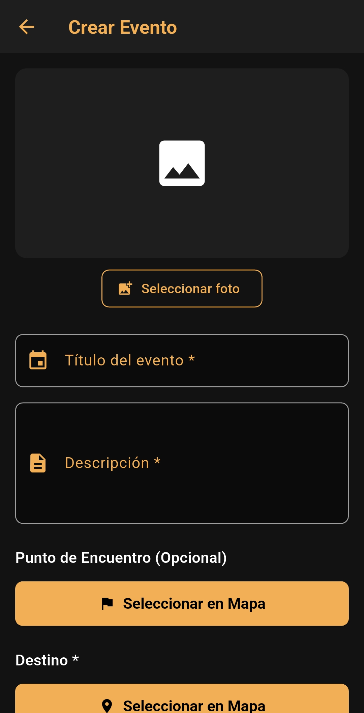

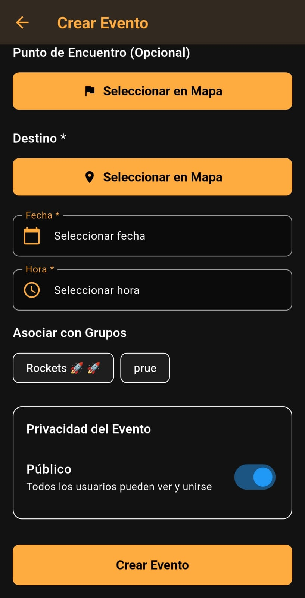

### 8.6 Editar o eliminar un evento

Solo el creador del evento puede editarlo o eliminarlo:

- Toca el menú del evento y selecciona **"Editar"** o **"Eliminar"**.
- Para eliminar, confirma la acción en el diálogo que aparece.

---

## 9. Módulo Talleres

Este módulo muestra una lista de talleres de motocicletas agregados por la comunidad.

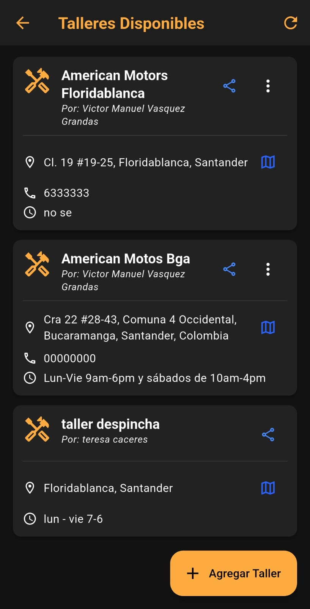

### 9.1 Ver talleres

Al entrar verás una lista de talleres con:

- Nombre, dirección
- Número de teléfono
- Creado Por (Mostrara el nombre del usuario de la comunidad que lo creo)
- Opción para compartir
- Mapa de ubicación
- Horario de atención

### 9.2 Agregar un taller

1. Desde la lista de talleres, toca el botón **"Agregar Taller"**.
2. Completa los datos del taller
3. Confirma con **"Guardar"**.

### 9.3 Compartir un taller en la Comunidad

Puedes compartir los talleres:
1. Abre el menú del taller.
2. Selecciona **"Compartir en comunidad"**.
3. Escribe una descripción y confirma.

### 9.4 Eliminar un taller propio

1. Abre el menú del taller.
2. Selecciona **"Eliminar"** y confirma en el diálogo.

---

## 10. Módulo Comunidad

Este módulo es el espacio social de MotoConnect donde los usuarios comparten experiencias, consejos, preguntas y más.

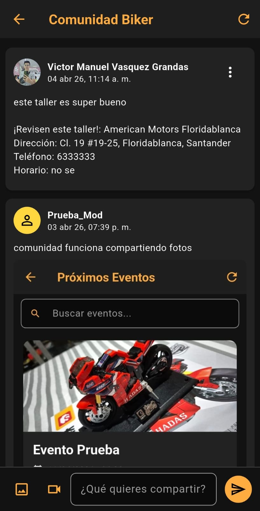

### 10.1 Ver publicaciones

Al entrar verás el **feed** con las publicaciones más recientes de la comunidad. Cada publicación muestra:
- Nombre y foto del autor
- Fecha de publicación
- Texto de la publicación
- Imagen o video adjunto (si tiene)
- Botón **"Ver Ruta en Mapa"** si es una ruta compartida

Desliza hacia abajo para ver más publicaciones. Usa el botón de actualizar (parte superior derecha) para refrescar el feed.

### 10.2 Crear una publicación

Escribe en **"¿Qué quieres compartir?"**, adjunta la foto o video si prefieres y dale al boton de enviar.

### 10.3 Editar o eliminar una publicación propia

Solo puedes editar o eliminar tus propias publicaciones:

1. Toca el menú (tres puntos) de tu publicación.
2. Selecciona **"Editar"** para modificar el texto, o **"Eliminar"** para borrarla.
3. Para eliminar, confirma en el diálogo que aparece.

---

## 11. Perfil

Accede a tu perfil tocando el **botón naranja** en la esquina inferior derecha de la pantalla principal.

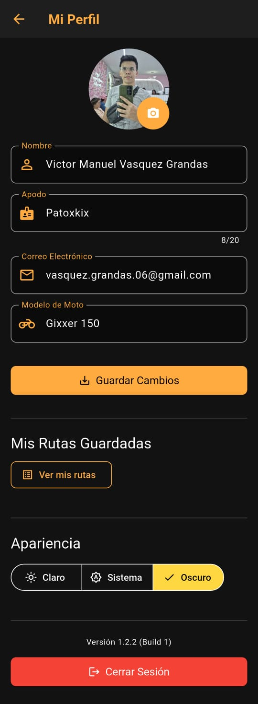

### 11.1 Cambiar foto de perfil

1. Toca el **ícono de cámara** sobre tu foto.
2. Elige una opción:
   - **Tomar foto:** usa la cámara del celular.
   - **Seleccionar de galería:** elige una imagen existente.
   - **Eliminar foto:** borra tu foto actual (te pedirá confirmación).

### 11.2 Editar datos personales

En la pantalla de perfil puedes modificar:
- **Nombre**
- **Apodo** (máximo 20 caracteres, visible en sesiones grupales)
- **Modelo de moto** (por ejemplo: *Yamaha MT-07*)

El correo electrónico no se puede modificar desde esta pantalla.

Cuando termines, toca **"Guardar Cambios"**. Aparecerá el mensaje *"Perfil guardado con éxito."*

### 11.3 Ver mis rutas guardadas

Desde la sección **"Mis Rutas Guardadas"** en el perfil, toca **"Ver mis rutas"** para ver todas las rutas que has guardado.

### 11.4 Cambiar el tema de la aplicación

En la sección **Apariencia**, elige entre:

| Opción | Resultado |
|---|---|
| **Claro** | Fondo blanco |
| **Sistema** | Sigue el tema del celular (claro u oscuro) |
| **Oscuro** | Fondo oscuro |

El cambio se aplica inmediatamente.

### 11.5 Ver la versión de la aplicación

Al final del perfil encontrarás la versión instalada:
**Versión 1.#.# (Build #)**

### 11.6 Cerrar sesión

1. Toca el botón **"Cerrar Sesión"** (color rojo, al final de la pantalla).
2. Confirma en el diálogo que aparece.
3. Serás redirigido a la pantalla de inicio de sesión.

---

## 12. Notificaciones

MotoConnect envía notificaciones para mantenerte informado incluso cuando no tienes la app abierta. Existen dos tipos:

### Notificaciones de Eventos

- Te avisan sobre nuevos eventos de la comunidad y recordatorios.

### Notificaciones de Sesiones Grupales

- Te informan cuando:
  - Se inicia una sesión en un grupo al que perteneces.
  - Alguien se une o abandona la sesión.
  - La sesión es finalizada.

> Para recibir notificaciones, asegúrate de tener el permiso de notificaciones habilitado para MotoConnect en los ajustes de tu celular.

---

## 13. Mensajes importantes

Durante el uso de la app verás distintos mensajes. Esta tabla explica qué significa cada uno:

| Mensaje | ¿Qué significa? |
|---|---|
| *"Cargando..."* | La app está iniciando. Espera un momento. |
| *"Calculando ruta..."* | La app está trazando el camino. Espera unos segundos. |
| *"¡Has llegado a tu destino!"* | Llegaste al lugar de destino. La ruta ha terminado. |
| *"Conexión perdida"* | Se perdió la conexión a internet. Verifica tu señal. |
| *"Tu conexión se ha restablecida"* | La conexión volvió. La app continuará normalmente. |
| *"Solicitud enviada. Esperando aprobación del líder..."* | Tu solicitud para unirte a la sesión fue enviada. Espera que el líder te apruebe. |
| *"¡Has sido aprobado! Compartiendo ubicación..."* | El líder te aceptó en la sesión. Ya apareces en el mapa. |
| *"Ubicación pausada. Otros no verán tu posición."* | Pausaste tu ubicación. Los demás no verán dónde estás hasta que la reanudes. |
| *"Ubicación reanudada. Compartiendo posición..."* | Tu ubicación vuelve a ser visible para el grupo. |
| *"El líder del grupo ha finalizado la sesión"* | El líder terminó la salida. Ya no hay sesión activa. |
| *"Ruta guardada correctamente"* | La ruta fue guardada exitosamente en tu perfil. |
| *"Perfil guardado con éxito."* | Los cambios en tu perfil fueron guardados. |

---

## 14. Problemas comunes

### No aparece mi ubicación en el mapa

**Posibles causas y soluciones:**

1. El GPS está desactivado. Ve a los ajustes de tu celular y activa la **ubicación**.
2. No otorgaste el permiso de ubicación a MotoConnect. Ve a **Ajustes > Aplicaciones > MotoConnect > Permisos** y activa **Ubicación**.
3. Estás en un lugar con señal GPS débil (sótanos, zonas muy cerradas). Sal al exterior e intenta nuevamente.

### No puedo instalar la aplicación

1. Asegúrate de haber habilitado la instalación de aplicaciones externas en tu celular.
2. Verifica que tienes suficiente espacio de almacenamiento disponible.
3. Si el problema persiste, busca en tu navegador: *"cómo instalar APK en [modelo de tu celular]"*.

### No veo la sesión activa de mi grupo

1. Verifica tu conexión a internet.
2. Actualiza la pantalla deslizando hacia abajo o usando el botón de actualizar.
3. Asegúrate de que aún eres miembro del grupo.

### No se actualiza el mapa durante una sesión

1. Verifica que tienes buena conexión a internet (4G o WiFi estable).
2. Confirma que el GPS está activado.
3. Si el problema continúa, sal de la sesión y vuelve a unirte.

### No recibo notificaciones

1. Ve a **Ajustes > Aplicaciones > MotoConnect > Notificaciones** y asegúrate de que estén habilitadas.
2. Verifica que el modo **"No molestar"** de tu celular no esté activo.

### No encuentro el grupo al intentar unirme

El código de invitación puede haber cambiado. Pide al administrador del grupo que te comparta el código actualizado.

### Los marcadores del mapa grupal no se actualizan

Esto puede indicar que uno o más participantes tienen señal débil. Los marcadores se colorearán según el tiempo sin actualización:
- Amarillo: 1 a 3 minutos sin actualización.
- Gris/Rojo: más de 3 minutos sin señal.

---

## 15. Buenas prácticas

Para disfrutar de la mejor experiencia con MotoConnect, te recomendamos:

1. **Mantén el GPS activado** durante toda la ruta, especialmente en sesiones grupales.
2. **Usa una conexión estable** (4G o WiFi) para que el mapa compartido funcione en tiempo real.
3. **Acepta todos los permisos** cuando la app te los solicite. Sin ellos, algunas funciones no funcionarán.
4. **No cierres la app durante una sesión grupal** sin antes salir de ella con el botón **"Salir de la sesión"**, para que los demás sepan que te fuiste.
5. **Mantén tu apodo actualizado** en el perfil, ya que es el nombre que verán tus compañeros de ruta en el mapa.
6. **Guarda tus rutas favoritas** para acceder a ellas fácilmente en el futuro.
7. **Cierra sesión** si vas a prestar tu celular a otra persona.
8. **Mantén la app actualizada** para recibir mejoras y correcciones.

---

*MotoConnect v1.2.5 — Abril 2026*
